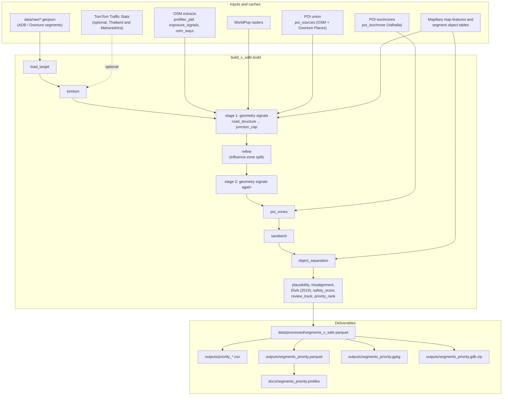
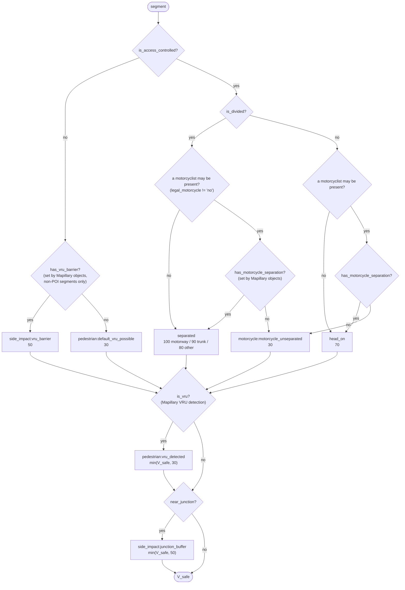
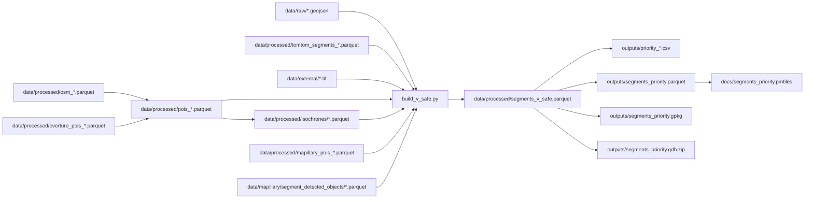

# Pipeline - ADB AI for Safer Roads, Safer Speeds Challenge

This document lists what the pipeline does, in the order it runs, with the module and output of each step. [README.md](README.md) covers the results and how to read them.

## 1. The question and the deliverables

> Does the current **posted speed limit** align with Safe System principles?

| Deliverable | Where |
|---|---|
| Analytical model | Code in `src/`, this document, [`README.md`](README.md) |
| Speed Safety Score | `safety_score`, `priority_class`, `review_track` in [`data/processed/segments_v_safe.parquet`](data/processed/segments_v_safe.parquet); CSV lists in `outputs/`; [`docs/speed_safety_score.md`](docs/speed_safety_score.md) |
| Geospatial visualization | `python src/serve_map.py` at http://localhost:8000/ ([`docs/index.html`](docs/index.html)); `outputs/segments_priority.parquet`; `outputs/segments_priority.gpkg`; `outputs/segments_priority.gdb.zip` |

## 2. Design rules

Every step below keeps these rules.

1. **The deliverable is the misalignment ranking.** `misalignment = SpeedLimit − V_safe`, and V_safe is the yardstick.
2. **V_safe takes no posted limit and no measured speed as input.** The signatures in `src/safe_speed.py` enforce this. The one exception is the Overture motorway fallback (F85 ≥ 50 km/h), and every row it touches records it.
3. **Measured speed is for diagnosis only**: `operating_gap` and the plausibility check.
4. **The posted limit is checked before use.** Plausibility splits priority rows into Review Needed and Field Verification Needed.
5. **Urban and rural exposure are scored separately.** In rural areas, missing data is treated as possible exposure (the safety-side correction).
6. **Uncertainty leans toward safety.** V_safe starts at 30 km/h, and low confidence lowers a score only a little.

## 3. Overall flow

The build order lives in `src/pipeline_order.py`. `build_v_safe.build()` runs it, and the browser panel draws it.



Stage 1 and stage 2 run the same nine geometry signals: `road_structure`, `road_access_join`, `pop_density`, `poi_proximity`, `crossing_signal`, `exposure_level`, `rural_margin`, `v_safe` and `junction_cap`.

## 4. Steps in detail

### Phase 0 - Load the analysis population

| | |
|---|---|
| Module | `src/schema.py` (`load_target`), `src/geometry.py` (representative points, UTM zones) |
| Input | `data/raw/ADB_Innovation_Thailand.geojson`, `data/raw/ADB_Innovation_Maharashtra.geojson`. GeoJSON is the main source because it has the full LineString |
| Output | 15,121 segments: `AnalysisStatus=='Valid'`, minus the 433 Maharashtra rows with `ExcludeFromSpeedSPI==1` and no `SpeedLimit` |
| Data quality | 410 Thailand segments whose `SpeedLimit`, `MedianSpeed` and `F85thPercentileSpeed` are all exactly 0 get `data_quality_flag='invalid_speed'`. They keep V_safe and exposure. Misalignment, score and plausibility skip them |

Maharashtra stores `SpeedLimit` as a JSON string, and `schema.py` converts it with `pd.to_numeric`.

### Phase 0b - TomTom (optional)

| | |
|---|---|
| Modules | `src/tomtom_stats.py` (read), `src/tomtom_data_integration.py` (cut and match; thresholds in `src/tomtom_match_rules.json`), `src/tomtom_enrichment.py` (build step `tomtom`) |
| Input | `data/raw/combined_traffic_stats_Thailand.geojson`, `data/raw/ADBMaha_combined_20250808.geojson` |
| Output | Segments cut into pieces, with `speed_data_source`, `speed_limit_source`, `speed_limit_adb` and the `tomtom_*` columns |

**Reading the file** (`tomtom_stats.py`). Thailand has 21,369 records and Maharashtra 27,559. Records with the same `abs(segmentId)` are the two directions of one road. They are paired and stored once, with `*_along` / `*_against` columns, and the directions are never averaged. A `speedLimit` that is not a multiple of 5 km/h cannot be a sign value and becomes NA (496 Thailand records, 2,264 Maharashtra). `travelTimeRatio` is 1.0 on 99.9% of rows and is dropped. `timeSet` and `dateRange` are undocumented constants, recorded in `data/processed/tomtom_segments_{country}_meta.json`.

**Matching** (`tomtom_data_integration.py`):

1. **Junctions.** A junction is a point where three or more ADB arms meet (vertices within 0.2 m), or an ADB line end within 1 m of another ADB line. An OSM node where three or more arms of public motor roads meet also counts, if it lies within 5 m on an OSM way the ADB line is built from. `service`, `track`, footways, paths and private roads do not count. TomTom lines are never a junction source.
2. **Uninterrupted segments.** ADB lines are cut at junctions. The pieces are then joined across line ends where exactly two ADB arms meet, no OSM junction lies, and the road class stays the same.
3. **Match each TomTom segment by shape.** Sample it every min(5 m, length / 10). Give each sample to the nearest ADB piece within 20 m whose bearing differs by 30° or less. Drop the TomTom segment if under 80% of its length is attributed. A part under 20% of the TomTom length and no longer than 20 m is an overhang past a junction, and is dropped. A part matches when the discrete Fréchet distance to its stretch of the uninterrupted segment is 20 m or less.
4. **Share a stretch.** Each direction is handled on its own. Neighbouring TomTom ranges meet at the midpoint of their gap or overlap. The first and last ranges fill out to the ends of the stretch. Values are never averaged across TomTom segments.
5. **Rows and ids.** A cut segment becomes `{id}#{j}`. Length columns are rescaled to each piece, and `sample_size_avg` and `sample_size_total` are copied unchanged.

A stand-alone run over the whole ADB layer (`python src/tomtom_data_integration.py --country both`) matches 16,426 of Thailand's 16,629 TomTom segments and 16,313 of Maharashtra's 18,943. Unmatched Maharashtra TomTom segments are mostly roads that ADB does not carry.

**Use in the build** (`tomtom_enrichment.py`):

- Where TomTom has a posted limit, it becomes `speed_limit`. The ADB value stays in `speed_limit_adb`, and `speed_limit_source` says which one is used.
- Observed speeds are filled only on `invalid_speed` rows. The flag is cleared only when all three speed fields are repaired.
- The single-valued columns (`tomtom_median_speed`, `tomtom_p85_speed`, `tomtom_mean_speed`, `tomtom_sd_speed`, ...) come from the direction with the larger sample (`tomtom_selected_direction`).
- TomTom's mean and SD feed the reported Elvik estimate. The 19 measured percentiles feed only the `exp_delta_*_empirical` check columns.
- A TomTom row gets +1/3 on `confidence_norm`, capped at 1.
- Without a TomTom file, every row reads `speed_data_source='overture'`.
- `aggregate_to_overture` is the length-weighted way back to ADB segments.

In the current build, 25,253 of 75,830 Thailand rows (21.9% of length) and 14,455 of 26,678 Maharashtra rows (11.3% of length) read `tomtom`.

### Phase 1 - External data

| Data | Module | Saved to |
|---|---|---|
| Population density (WorldPop 2020) | `fetch_worldpop.py` | `data/external/*.tif` |
| OSM pbf pre-filter (`osmium tags-filter`) | `prefilter_pbf.py` | `data/external/*.5s-filtered.osm.pbf` (derived, gitignored) |
| OSM POIs, crossings, pedestrian ways | `exposure_signals.py` | `data/processed/osm_*.parquet` |
| OSM road ways (every `highway=*`) | `osm_ways.py` | `data/processed/osm_ways_{country}.parquet` |
| Overture Places POIs | `fetch_overture_pois.py` | `data/processed/overture_pois_{country}.parquet` |
| POI union (OSM + Overture) | `poi_sources.py` | `data/processed/pois_{country}.parquet`, rebuilt when an input is newer |
| POI walking isochrones | `poi_isochrone.py`, `valhalla_service.py` | `data/processed/isochrones/{type}_{country}_u{urban}_r{rural}.parquet` |
| Mapillary map features | `fetch_mapillary_features.py`, `exposure_signals.load_mapillary_pois` | `data/mapillary/map_features_*.json` -> `data/processed/mapillary_pois_*.parquet` |
| Junction nodes (`highway=traffic_signals`, `junction=yes`) | Overpass Turbo export | `data/external/osm_junctions_*.geojson` |

The pre-filter cuts Thailand's pbf from 323.7 MB to 24.1 MB, and extraction then takes about 41 seconds (Maharashtra about 28 seconds). `verify_prefilter_equivalence.py` checks that it reproduces the committed `osm_*.parquet`. Never use the filtered pbf to build Valhalla tiles, because it lacks most of the road network.

**POI union.** An Overture place is kept if its `confidence` is at least 0.5 or it is in the top 95% of its country and category. Schools and hospitals also need a name on a keyword list. An Overture point within 10 m of a same-category OSM feature is dropped as a duplicate. Both confidence values are run parameters (`src/poi_params.py`).

**Coverage.** Samples showed thousands of OSM pedestrian tags and usable Mapillary images in Bangkok and Pune. Rural samples had 0 to 4 tags and no images. So urban exposure uses crossings and Mapillary, and rural exposure uses population and POIs plus the safety-side correction.

### Phase 2 - V_safe and exposure

| Step | Module | What it does |
|---|---|---|
| Road structure | `road_separation.py`, `segment_way_match.py`, `road_structure_flags.py` | Matches each segment to the OSM ways it was built from (identical coordinates at 6 decimals, then 5 m and 30° for the rest; rules in `src/match_rules.json`). Sets `is_access_controlled` (every matched way is `highway=motorway` or `motorroad=yes`), `is_divided` (95% of length has `lanes:divided=yes`, `dual_carriageway=yes` or `oneway` other than `no`), and `is_grade_separated` (any matched way is a bridge, tunnel or non-zero layer). With no OSM match, an Overture `motorway` with F85 ≥ 50 counts as access-controlled (`overture_motorway_fallback`) |
| Legal access | `road_access_join.py`, `road_access.py`, `road_access_rules.json` | Legal access per travel mode. Where OSM bars both pedestrians and cyclists, the segment becomes access-controlled (`osm_vru_prohibited`). Sets `legal_motorcycle` |
| Population | `pop_density.py` | Maximum WorldPop value at the start, middle and end of the segment |
| POI proximity | `exposure_signals.add_poi_proximity` | POIs and Mapillary points within 200 m (urban) or 400 m (rural). Writes the category bools, `poi_count`, `is_mapillary_vru`, `is_vru` and `vru_speed_cap`. `is_vru` is forced False on access-controlled segments |
| Crossings | `exposure_signals.add_crossing_signal` | OSM `highway=crossing` within 25 m, urban only. Crossings on footbridges and underpasses are excluded |
| Exposure level | `exposure_level.py` | Percentile rank of each signal within its track, averaged, then cut into terciles. Urban: population, POIs, Mapillary VRU, crossings. Rural: population and POIs. Used for priority only |
| Rural correction | `exposure_level.apply_rural_safety_margin` | A rural row in the top quarter of its country's rural population density, with no crossing, is raised to at least Medium with `exposure_confidence='low'` |
| V_safe | `safe_speed.py` | See the decision flow below |
| Junction cap | `junction_speed_cap.py` | Within 300 m of a junction node, V_safe is capped at 50. Full motorways and grade-separated segments are excluded |

#### V_safe decision flow (per segment)



- Only access control can raise V_safe above 30, apart from the Mapillary barrier rule (50). Where a motorcyclist may be present, access control raises it only together with `has_motorcycle_separation`. Every other rule is a `min()` cap.
- `is_access_controlled` and `is_divided` are separate flags. A two-way motorway without motorcycles is access-controlled and undivided (70). A one-way city street is divided without access control (30).
- The VRU cap acts only on segments that `has_vru_barrier` raised to 50, since `is_vru` is False on access-controlled segments. No row has `has_vru_barrier` in the current build, so the cap changes no value today.
- The full condition table per travel mode is in [`docs/v_safe_raise_conditions.md`](docs/v_safe_raise_conditions.md).

#### Influence-zone split (`refine`)

`segment_localization.py` cuts long segments where a VRU zone (Mapillary detections, 200 m urban / 400 m rural) or a junction zone (300 m) begins and ends. Gaps shorter than 50 m between two zones are absorbed into the zone, and pieces shorter than 50 m are not created. Stage 2 then runs the nine geometry signals again on the pieces. `_make_child` copies every parent column, `sample_size_avg` and `sample_size_total` included.

#### POI zones (`poi_zones`)

`poi_speed_zones.py` runs on the final geometry:

1. For each enabled POI type, load its isochrones (`poi_isochrone.load_selected_isochrones`) and drop those that touch no segment without access control.
2. Union them per type, then per speed. Each zone keeps a bool per type (`is_school_zone`, `is_near_hospital`, `is_near_marketplace`, `is_near_shop`, `is_near_bus_stop`).
3. Apply the zones from the highest speed to the lowest. A zone covering at least 80% of a segment applies to the whole segment. A zone covering less cuts it (`{segment_id}-p{speed}-{k}`) and applies to the covered pieces. Applying lowers V_safe to the zone speed (`pedestrian:poi_zone_{speed}kmh`) and sets the type bools.

The isochrones are Valhalla walking areas, by default 3 minutes urban and 5 rural. In rural areas each zone also includes a 200 m circle, because the OSM walking network there is thin. A build fails if an enabled type has no isochrone cache for its minutes. The `poi_isochrones` step builds missing caches, starting one country's Valhalla container at a time (see `valhalla/README.md`). School isochrones exist for every candidate school (60,384 Thailand, 17,216 Maharashtra), so changing the confidence rule never needs Valhalla.

#### Short segments (`sandwich`)

`sandwich_segments.py`: a segment Y without access control, at most `sandwich_max_length_m` long (default 250 m), whose neighbours within 1 m of both ends all have a lower V_safe, takes `max(V_safe(A), V_safe(B))`. A and B are the neighbours that turn least from Y. The rule repeats until nothing changes, and marks rows with `is_sandwich`.

#### Mapillary object separation (`object_separation`)

`segment_detected_objects.apply_object_separation` reads `data/mapillary/segment_detected_objects/{Region}_segment_detected_objects.parquet` and acts on segments outside every POI zone:

- `physical_median_likelihood` ≥ 1 sets `is_divided = True` (`mapillary_divided = True`).
- `pedestrian_protection_likelihood`, `cyclist_protection_likelihood` and `motorcyclist_protection_likelihood` all ≥ 1 set `has_vru_barrier = True`.
- `motorcyclist_protection_likelihood` ≥ 1 sets `has_motorcycle_separation = True`: a barrier separates riders from four-wheeled traffic, so an access-controlled segment takes the speed of a road without motorcycles.

V_safe is recomputed with `safe_speed.add_v_safe`, and a row takes the new value only when it is higher. The VRU cap and the junction cap still apply. In the current build, 375 rows get `mapillary_divided`, no row gets `has_vru_barrier`, and no V_safe changes.

#### The pre-split rule, for comparison (`--legacy`)

`python src/build_v_safe.py --legacy` (or `V_SAFE_INCLUDE_LEGACY=1` for the GUI) adds `*_legacy` columns with the pre-split rule (the single `is_separated` flag), as built at commit `7cd7d15`. Nothing downstream reads them, and the GIS exports drop them. `src/verify_legacy_fidelity.py` checks them against that commit's build.

### Phase 3 - Misalignment, score and lists

| Order | Module | Output |
|---|---|---|
| 1 | `speedlimit_plausibility.py` | `speedlimit_plausibility`: `low` if the limit is an IQR outlier within (country, road_class, land_use), or differs from F85 by more than 30 km/h |
| 2 | `misalignment.py` | `misalignment`, `misalignment_magnitude`, `excess_caution_magnitude`, `operating_gap` |
| 3 | `elvik_2019.py` | `exp_delta_fatal_percent_uniform` (reported), `exp_delta_fatal_abs`, the `tailcap` and severity variants, `exp_delta_*_empirical` |
| 4 | `safety_score.py` | `safety_score`, `priority_class`, `score_explanation`, and the three score terms `misalignment_norm`, `exposure_norm`, `confidence_norm` (each in [0, 1]; a term's contribution to the score is weight × term × 100) |
| 5 | `review_track.py` | `review_track`: Review Needed / Field Verification Needed |
| 6 | `priority_lists.py` | `road_environment`, `rank_within_environment`, `confidence_note` |

```
safety_score = 100 × (0.50 × misalignment + 0.35 × exposure + 0.15 × confidence)
```

The priority classes, the exposure terciles and the list ranks are computed separately in each of the four (country, land_use) or (country, road_environment) cells. The priority classes take the top 3% / 10% / 20% of each cell's total length (WGS84 geodesic length of the geometry). A row joins a class when the length ranked above it is below the class's share, so the row that crosses a boundary is included. Length is used because the build splits segments, and a count would give a heavily split stretch more of the list. Rows are sorted by `safety_score`, then by `exp_delta_fatal_percent_uniform` (largest first, missing last), then by `segment_id`. The Elvik step therefore runs before `safety_score`. It never changes a score: it decides which of the rows sharing a score fill a class, and the lists use it the same way to order rows that share a rank.

### Phase 4 - Deliverables

`python src/quick_reproduce.py` rebuilds all of these from `data/processed/segments_v_safe.parquet` alone. Full and Complete runs write them after the build.

| File | Module | Content |
|---|---|---|
| `outputs/priority_review_needed.csv`, `outputs/priority_field_check.csv` | `review_track.py` | The two review lists |
| `outputs/priority_urban.csv`, `outputs/priority_rural.csv` | `priority_lists.py` | Lists ranked within urban and rural |
| `outputs/priority_map.html` | `priority_map.py` | folium map (not committed, too large) |
| `outputs/priority_map_static.png` | `priority_map.py` | Static summary |
| `outputs/segments_priority.parquet` | `priority_map.write_geo_outputs`, `kepler_parquet.py` | GeoParquet for GIS and kepler.gl. Text columns are plain strings. The TomTom percentile lists and `*_legacy` columns are dropped. `shape_length` is overwritten with the WGS84 geodesic length of the final geometry (metres, float). `AADT` is followed by three empty fields, `apply_median` (boolean), `apply_sidewalk` (boolean) and `bcr` (double), which hold no values and are filled in later in the GIS |
| `outputs/segments_priority.gpkg` | `priority_map.write_gpkg` | The same columns in one GeoPackage layer, `segments_priority`. Bools stay booleans and 64-bit integers stay 64-bit. Not committed (over GitHub's 100 MB limit) |
| `outputs/segments_priority.gdb.zip` | `priority_map.write_gdb_zip` | The same columns in one feature class, `segments_priority`, of a zipped File Geodatabase for ArcGIS Online. Bools (including `apply_median` and `apply_sidewalk`) become 0/1 integers, since a File Geodatabase has no boolean field type, and 64-bit integers that fit become 32-bit. Written last |
| `docs/segments_priority.pmtiles` | `build_tiles.py` | Vector tiles for the web map, carrying only the 15 properties `docs/index.html` reads (`INCLUDED_PROPERTIES`). Needs tippecanoe |

`AADT` (annual average daily traffic, vehicles/day) is estimated by `aadt_estimation.py`, which runs between `priority_map` and `geo_outputs` so the three exports read it off the same frame:

```
AADT = clip(round(sample_size_avg × weighted_scale × scaling_to_2025), 10, 200000)
```

`weighted_scale` is calibrated in `docs/AADT Scaling.xlsx` over the seven segments whose traffic was counted: four in Maharashtra from the NH-211 project report (Egis India Consulting Engineers 2012), three in Thailand from the rural road network AADT (Department of Rural Roads 2026, 2025). For each region: the counted volume is carried to the probe year by the product of that country's annual GDP growth factors (World Bank `NY.GDP.MKTP.KD.ZG`), then the sum of the carried volumes is divided by the sum of the probe counts. Maharashtra gets 1.09533 and Thailand 0.04500. The probe count is `sample_size_avg`, the mean over the TomTom samples taken every 10 km along a segment and in each direction; `sample_size_total`, their sum, also grows with the segment's length and the number of directions sampled. `scaling_to_2025` carries Thailand's 2024 probes one more year (1.02442); Maharashtra's are already 2025 (1.0). `sample_size_avg` belongs to the parent ADB segment and every piece keeps it, so the estimate is made once per parent and given to all of its pieces. The browser panel takes both scale factors as inputs; `scaling_to_2025` and the clip bounds are fixed. A frame reaching the export without the column falls back to `priority_map.AADT_PLACEHOLDER = 1000`.

The map shows `map_class`, a display-only split of `Low Priority` into Aligned (`misalignment <= 0`) and Low Priority (the rest). `priority_class` itself stays unchanged.

## 5. Mapillary data preparation (run by hand)

These scripts prepare the Mapillary files the build reads. They need `MAPILLARY_TOKEN` in `.env`.

| Order | Module | Output |
|---|---|---|
| 1 | `extract_map_features.py` | Corridor tile cover `data/mapillary/tile_cover/{region}_z14.parquet`, decoded map-feature tiles, and `filtered_map_features/{region}/` |
| 2 | `fetch_mapillary_features.py` | `data/mapillary/map_features_{country}.json` (26 VRU classes) for `is_mapillary_vru` |
| 3 | `fetch_image_ids.py` | Image IDs from the z14 `image` vector tiles, kept within 10 m of the roads: `filtered_image_ids/{region}/` |
| 4 | `central_image_ids.py` | For each segment outside every POI zone, the image nearest its midpoint (matched within 8 m): `central_image_ids/{region}_central_image_ids.csv` |
| 5 | `fetch_detected_objects.py` | The object classes Mapillary detected in the images around each central image (Graph API `/images?bbox=`, 1 m padding, limit 2000): `detected_objects/{region}/` |
| 6 | `segment_detected_objects.py` | Places the scored objects on segments (via the nearest OSM way within 20 m, then the nearest segment within 8 m) and adds up the weights in `mapillary_detectable_objects.csv`: `segment_detected_objects/{Region}_segment_detected_objects.parquet` |

## 6. `src/` modules in run order

| Stage | Module | Role |
|---|---|---|
| Setup | `fetch_worldpop.py` | WorldPop download and crop |
| Setup | `prefilter_pbf.py`, `exposure_signals.py`, `osm_ways.py`, `osm_way_source*.py` | OSM extraction and caches |
| Setup | `fetch_overture_pois.py`, `poi_sources.py`, `poi_params.py`, `poi_categories.py` | POIs, the union, run parameters, Mapillary class mapping |
| Setup | `poi_isochrone.py`, `valhalla_service.py` | Walking isochrones and the Valhalla container |
| Setup | `extract_map_features.py`, `fetch_mapillary_features.py`, `fetch_image_ids.py`, `central_image_ids.py`, `fetch_detected_objects.py`, `segment_detected_objects.py` | Mapillary data (section 5) |
| Setup | `tomtom_stats.py` | TomTom read and cache |
| Build | `schema.py`, `geometry.py` | Load, common schema, representative points |
| Build | `tomtom_data_integration.py`, `tomtom_enrichment.py` | TomTom cut, match and enrichment |
| Build | `road_separation.py`, `segment_way_match.py`, `road_structure_flags.py`, `road_access_join.py`, `road_access.py` | Road structure and legal access |
| Build | `pop_density.py`, `exposure_signals.py`, `exposure_level.py` | Exposure |
| Build | `safe_speed.py`, `junction_speed_cap.py` | V_safe |
| Build | `segment_localization.py` | Influence-zone split |
| Build | `poi_speed_zones.py`, `sandwich_segments.py`, `segment_detected_objects.py` | POI zones, short segments, Mapillary objects |
| Build | `speedlimit_plausibility.py`, `misalignment.py`, `safety_score.py`, `review_track.py`, `priority_lists.py`, `elvik_2019.py` | Scores and lists |
| Run | `build_v_safe.py` | Full build |
| Run | `quick_reproduce.py` | Deliverables from the committed parquet |
| Run | `pipeline_order.py`, `pipeline_steps.py`, `pipeline_runner.py`, `pipeline_service.py`, `serve_map.py` | Browser panel and its API |
| Output | `aadt_estimation.py` | AADT from probe counts, before the two exports |
| Output | `priority_map.py`, `kepler_parquet.py`, `build_tiles.py` | Maps, GeoParquet, File Geodatabase, tiles |
| Output | `sensitivity_analysis.py` | Sensitivity tables (`--severity fatal` or `all3`) |
| Checks | `verify_prefilter_equivalence.py`, `verify_legacy_fidelity.py`, `osm_coverage.py`, `mapillary_coverage.py`, `road_class_coverage.py`, `compare_poi_sources.py`, `safe_system_inputs.py`, `auxiliary_data.py`, `explore_raw.py`, `plot_representative_points.py` | One-off checks and inventories |

## 7. Data flow by file



## 8. How to run

All commands run from the repository root.

### First-time setup

```bash
python -m venv .venv && source .venv/bin/activate
pip install -r requirements.txt
```

Set `MAPILLARY_TOKEN` in `.env` only if you fetch Mapillary data.

### In the browser

```bash
python src/serve_map.py --enable-pipeline    # http://localhost:8000/
```

Presets: **Quick** (deliverables from the committed parquet), **Full** (the build from the raw GeoJSON, plus missing isochrones), **Complete** (also WorldPop, osmium, pyrosm and Overture Places). A step whose prerequisite is missing is skipped with a reason, and the run continues. The exception is `poi_isochrones`: if it cannot build an isochrone the run needs, the run stops. Without `--enable-pipeline` the panel is shown but cannot run anything.

Checks for the GUI:
1. With **Quick**, every step goes green, and the CSV lists and GIS files get new timestamps.
2. During **Full**, a browser reload or a second tab shows the same live run.
3. **Cancel** stops the step within about five seconds, and `pgrep -f pipeline_runner` then finds nothing.
4. Stopping the server with Ctrl-C leaves no orphan process. After a restart, the run shows as `interrupted`.
5. `python src/build_v_safe.py` from the CLI produces the same `segments_v_safe.parquet` as a Full run.

### Deliverables only

```bash
python src/quick_reproduce.py
```

### Full rebuild from scratch

```bash
# 1. WorldPop
python -c "import sys; sys.path.insert(0, 'src'); from fetch_worldpop import fetch_thailand, fetch_maharashtra; fetch_thailand(); fetch_maharashtra()"
# 2. (Only to refresh OSM; needs osmium-tool)
python src/exposure_signals.py && python src/road_separation.py
# 3. POI union
python src/fetch_overture_pois.py thailand maharashtra && python src/poi_sources.py thailand maharashtra
# 4. Isochrones (only when the POI union changed; needs Docker; see valhalla/README.md)
python src/poi_isochrone.py --country thailand --poi-type school --force
# 5. Build, deliverables, tiles
python src/build_v_safe.py
python src/quick_reproduce.py
python src/build_tiles.py
```

Step 4 needs that country's Valhalla container running (`docker compose --profile thailand up` in `valhalla/`). The `poi_isochrones` step of a Full run starts and stops it for you.


## 9. Known limitations built into the pipeline

- Only the 15,121 segments with speed data (about 22% of the network) are analysed.
- `SpeedLimit`, `LandUse` and `RoadClass` are Overture estimates (per the ADB FAQ).
- Rural OSM and Mapillary coverage is thin, so rural exposure relies on the safety-side correction.
- V_safe rests on OSM tags. The OSM match covers 98.35% of Thailand length and 99.20% of Maharashtra length. Rows without a match stay at 30 km/h unless the Overture motorway fallback applies.
- `is_grade_separated` is True if any matched way is a bridge, tunnel or non-zero layer. Short canal bridges make this true on 24.7% of Thailand rows and 25.2% of Maharashtra rows, and all of them are excluded from the junction cap.
- In rural areas the walking isochrones depend on a thin OSM walking network. The 200 m circle floor keeps a zone from shrinking below that radius.
- The isochrone minutes, buffer radii, class cut-offs and sandwich length are judgment calls, exposed as parameters.
- Pieces inherit the parent's speeds, `sample_size_avg` and `sample_size_total`.
- `osm_junctions_*.geojson` is a manual Overpass Turbo export (`highway=traffic_signals` or `junction=yes`).
- `AADT` is scaled from probe counts with one factor per region, calibrated on seven counted segments. Pearson's r between counted volume and probe count is 0.95 in Maharashtra and 1.00 in Thailand, and the estimate assumes probe counts are proportional to traffic and that GDP growth tracks traffic growth. 9% of rows sit at the 200,000 ceiling.
